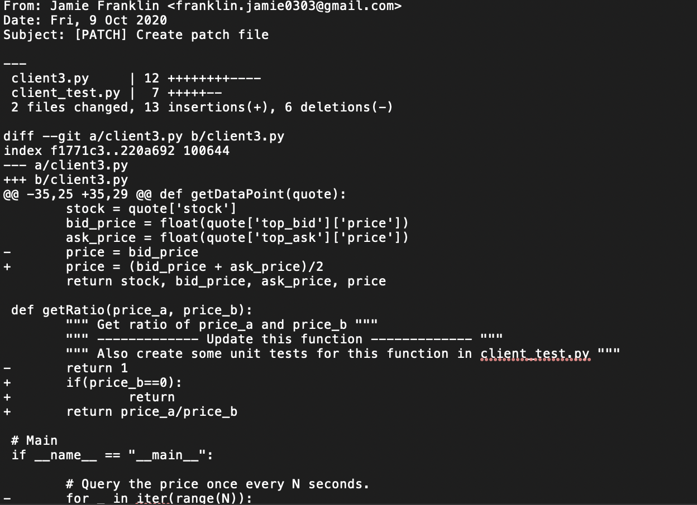

# **JPMorgan-SE-Virtual-Internship**

In this repository I will list the code used, and the modifications made during the virtual experience provided by JP Morgan.

The goal of the experience was to provide functionality to be added to a trader's dashboard to allow them to input specific information to monitor a new trading strategy.

The experience was split into 3 tasks to achieve this, I will briefly explain them below.

### Task 1: "Fixing broken client datafeed and creating patch files"

  Using basic programming in python I fixed the stock price data feed so the code executes properly.
  
  Generated a .patch file of changes made using the command line.
  

### Task 2: "Fix the broken typescript files in repository to make the web application output correctly"

  I fixed the client side web application so it automatically updates as new data is pulled from its server, making sure to not aggregate duplicate data.
  
  Dependencies and APIS used: node, npm, typescript, react.
  
  Modifications were recorded in a .patch file.
  
 
### Task 3: "Modify the typescript files in repository to make the web application behave in the expected manner"

  Developed the automatically updating data to display on a line graph, showing change in the ratio 2 stock prices. Offering a visually simple way for the trader to    notice if the ratio too far from the historical correlation.

  An alert was triggered if the ratio strayed +/- 10% of the 12 month historical average.
  
  
  
